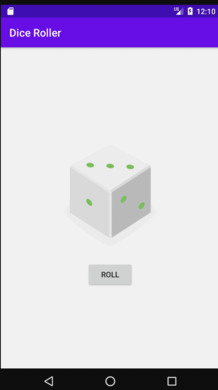

# Dice_Roller
## Описание
Имитация броска игральной кости
## Цель
Изучить основы построение Android application с ипользованией языка  Kotlin
## Использовано
1. Linear layout
2. Drawable
3. Input events
4. Device compatibility
5. Android studio
6. Git
## Внешний вид

